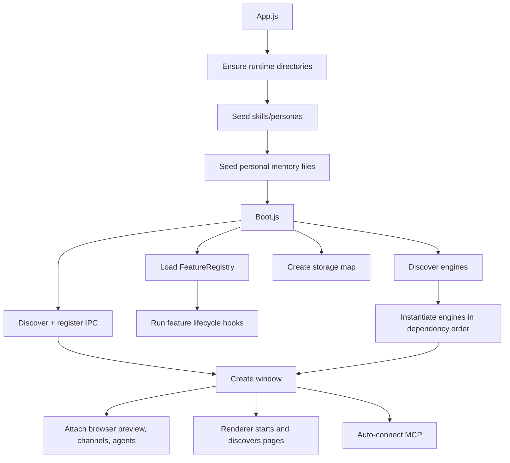
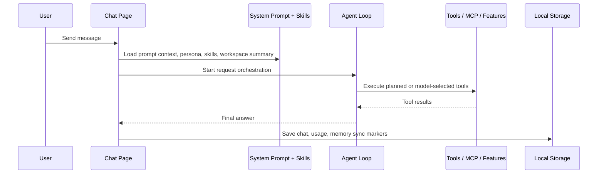

# Joanium Architecture

This document explains how Joanium is assembled, what runs in which layer, and how a request moves from the UI to providers, tools, connectors, and persisted state.

## 1. High-Level Design

Joanium is an Electron desktop app with a strong local-first bias and a modular runtime. The product is not built as one giant hard-coded assistant. Instead, it is composed from:

- workspace packages
- feature manifests
- engine metadata
- auto-discovered IPC modules
- auto-discovered services
- page manifests

That composition model is one of the repo's biggest strengths. It lets the app grow in breadth without forcing every new capability through the same central file.

## 2. Runtime Layers

| Layer                     | Main location                                                                            | Responsibility                                                                                                                    |
| ------------------------- | ---------------------------------------------------------------------------------------- | --------------------------------------------------------------------------------------------------------------------------------- |
| Electron entry            | `App.js`                                                                                 | Creates runtime directories, seeds local libraries, boots the app, creates the main window, and starts engines.                   |
| Main-process boot         | `Packages/Main`                                                                          | Discovery, dependency assembly, paths, services, IPC registration, window creation, and shared runtime context.                   |
| Features and engines      | `Packages/Features`                                                                      | Long-lived runtime systems such as agents, automations, connectors, channels, MCP, browser preview support, and storage plumbing. |
| Capabilities              | `Packages/Capabilities`                                                                  | Integration-specific features that contribute connectors, prompt context, chat tools, automation handlers, and feature pages.     |
| Renderer shell            | `Packages/Renderer`                                                                      | Page discovery, routing, sidebar setup, modal wiring, and top-level app navigation.                                               |
| Renderer pages            | `Packages/Pages`                                                                         | The actual user-facing product surfaces: chat, setup, automations, agents, skills, personas, marketplace, events, and usage.      |
| Shared system layer       | `Packages/System`                                                                        | Common contracts such as `defineEngine` and `definePage`, plus shared state, prompt helpers, and utilities.                       |
| Local state and libraries | `Config`, `Data`, `Instructions`, `Memories`, `Skills`, `Personas`, `SystemInstructions` | Models, user config, persisted runtime state, memory files, seeded libraries, and base system prompt assets.                      |

## 3. Boot Sequence

The boot flow starts in `App.js`.

### What `App.js` does

- sets Electron process flags and a browser user agent fallback
- ensures runtime directories exist
- initializes seeded content libraries for skills and personas
- initializes personal memory markdown files
- calls `boot()` from `Packages/Main/Boot.js`
- starts engines after boot
- creates the main window
- auto-connects MCP servers after startup

### What `Packages/Main/Boot.js` does

- loads all feature manifests through `FeatureRegistry.load(...)`
- discovers engines from declared engine roots
- builds feature/engine storage handles through `createFeatureStorageMap(...)`
- instantiates engines in dependency order using each engine's `needs` and `provides`
- runs feature lifecycle hooks such as `onBoot`
- discovers and registers IPC modules, auto-injecting services and engine context
- returns the boot payload used by the rest of the app

### Boot flow diagram

## 4. Discovery Is the Backbone

Joanium uses workspace package manifests to declare discovery roots. The root `package.json` defines npm workspaces, and each workspace package can add a `joanium.discovery` section such as:

- `features`
- `engines`
- `ipc`
- `pages`
- `services`

`Packages/Main/Core/WorkspacePackages.js` expands the workspace list from the root manifest. `Packages/Main/Core/DiscoveryManifest.js` then collects discovery roots for each supported kind.

This means Joanium can grow by package composition:

- a capability package can expose a `Feature.js`
- an engine package can expose a `*Engine.js`
- a page package can expose one or more `Page.js` files
- a service package can expose `*Service.js`
- an IPC package can expose `*IPC.js`

The boot layer does not need hand-written imports for each one.

## 5. Feature Registry Composition

`Packages/Capabilities/Core/FeatureRegistry.js` is one of the most important files in the repo.

It loads every discovered `Feature.js`, sorts them topologically by `dependsOn`, and indexes what each feature contributes.

### A feature can contribute

- service connectors
- free connectors
- connector service extensions
- feature pages
- renderer chat tools
- automation data sources
- automation output types
- automation instruction templates
- prompt context sections
- lifecycle hooks
- feature main methods
- storage descriptors

### Why this matters

A capability package in Joanium is not just "an integration". It can plug into multiple surfaces at once:

- setup and connector configuration
- chat tools
- automation building blocks
- prompt context
- renderer-visible pages

That is why the feature registry is the center of product composition.

## 6. Engines and Long-Lived Runtime Behavior

Engines are discovered from `*Engine.js` files and normalized through `Packages/System/Contracts/DefineEngine.js`.

### Current engine-style systems

- `Packages/Features/Agents/Core/AgentsEngine.js`
- `Packages/Features/Automation/Core/AutomationEngine.js`
- `Packages/Features/Channels/Core/ChannelEngine.js`
- `Packages/Features/Connectors/Core/ConnectorEngine.js`

### Engine responsibilities

- load and persist their own state
- start background timers or polling loops
- expose runtime methods through injected context or IPC
- coordinate with the renderer when human-facing execution is required

### Important runtime pattern

Not every "agentic" behavior is executed fully inside the main process.

For example:

- the agents engine schedules and dispatches work
- the renderer-side gateway receives the request
- the chat/agent loop performs model calls and tool orchestration
- results are sent back to the engine for persistence and history

That split lets Joanium reuse the same orchestration logic for chat and background agent runs.

## 7. IPC and the Preload Bridge

Joanium uses Electron IPC for the boundary between renderer and main.

### Main-process IPC

`Packages/Main/Core/DiscoverIPC.js` scans `*IPC.js` files and calls their exported `register(...)` function. If an IPC module declares `ipcMeta.needs`, the boot layer injects matching services or engines from context.

Examples of IPC modules:

- `Packages/Main/IPC/PagesIPC.js`
- `Packages/Main/IPC/TerminalIPC.js`
- `Packages/Main/IPC/ProjectIPC.js`
- `Packages/Features/Agents/IPC/AgentsIPC.js`
- `Packages/Features/Automation/IPC/AutomationIPC.js`
- `Packages/Features/MCP/IPC/MCPIPC.js`

### Preload

`Core/Electron/Bridge/Preload.js` exposes two bridges:

- `window.electronAPI` for generic IPC calls/events
- `window.featureAPI` for feature boot payload and feature method invocation

That split is useful:

- generic desktop/runtime APIs stay under `electronAPI`
- feature-composed behavior stays under `featureAPI`

## 8. Renderer Architecture

The renderer shell starts in `Packages/Renderer/Application/Main.js`.

### Renderer shell responsibilities

- discover built-in pages from the main process
- merge feature-contributed pages from the feature boot payload
- build the sidebar navigation
- mount and unmount pages dynamically
- initialize shared modals
- initialize gateways for channels and scheduled agents

### Important renderer pattern

Pages are loaded by manifest, not by one fixed router table. `Packages/Renderer/Application/PagesManifest.js` builds the page map after discovery.

That gives Joanium a modular page system similar to its feature system.

## 9. Page Model

Each top-level page typically includes:

- `Page.js` for the manifest
- `*.html` for the shell entry file when needed
- `UI/Render/index.js` for page mounting logic
- `UI/Styles/*` for styling
- optional `Features`, `Components`, `Templates`, `Builders`, `State`, or `Utils`

Current discovered pages include:

- Chat
- Setup
- Automations
- Agents
- Skills
- Marketplace
- Personas
- Events
- Usage

Feature packages can also contribute additional pages through the feature registry boot payload.

## 10. Chat Request Lifecycle

The chat page is the center of the user experience, and it also acts as the shared orchestration layer for some background features.

### Main path

1. The user writes a message in the chat page.
2. The renderer loads providers, skills, workspace state, and system prompt context.
3. The request planner can select skills and pre-plan tool calls.
4. The agent loop executes model calls, tool calls, fallbacks, browser steps, and sub-agent coordination.
5. Tool execution is delegated to local capabilities, terminal/workspace tools, MCP, or feature-contributed handlers.
6. The final answer is rendered in chat.
7. Chat history, usage, and personal memory sync state are persisted locally.

### Sequence view

## 11. Prompt Assembly

The runtime system prompt is built from several sources, not one static file.

### Base inputs

- `SystemInstructions/SystemPrompt.json`
- user profile from config
- active persona markdown
- connected service summaries from feature prompt hooks
- feature-defined prompt context sections
- custom instructions from `Instructions/CustomInstructions.md`
- runtime metadata such as date, time, platform, and hardware

### Key files

- `Packages/Main/Services/SystemPromptService.js`
- `Packages/System/Prompting/SystemPrompt.js`
- `Packages/Main/Services/ContentLibraryService.js`

This is why changing persona behavior, connector context, or custom instructions can all affect the assistant without rewriting the core chat loop.

## 12. Persistence Model

Joanium is intentionally local-first.

### In development

- the repo root acts as the state root

### In packaged builds

- Electron `userData` acts as the state root

### Practical result

The same code can work in development and production while storing:

- chats
- project definitions
- usage data
- connector state
- MCP server config
- agent and automation state
- enabled skills
- active persona
- custom instructions
- personal memory files

in predictable local files.

See [Data-And-Persistence.md](Data-And-Persistence.md) for the full storage map.

## 13. Packaging and Distribution

`electron-builder.json` packages the Electron app and ships bundled assets such as:

- core app code
- packages
- assets
- system instructions
- model catalogs
- window state defaults
- seed skills and personas

The project is configured to publish releases through GitHub Releases, and packaged builds use the Electron auto-update path configured by the app.

## 14. Architectural Strengths

The current repo has several strong architectural choices:

- discovery-based composition lowers the cost of adding new capabilities
- feature registry composition prevents integration logic from being scattered everywhere
- engine separation keeps background runtimes out of the page layer
- renderer page discovery keeps the shell extensible
- local-first state makes the app understandable and hackable for contributors
- markdown-based skills and personas reduce friction for customization

## 15. Architectural Watchouts

A few things contributors should always keep in mind:

- development mode writes state into the repo root, so be careful with commits
- some user flows span main process, preload, renderer shell, and a page-specific feature folder at the same time
- chat orchestration is powerful but broad; changes there can affect chat, scheduled agents, channel replies, and tool behavior
- feature storage keys must stay unique across both features and engines
- discovery relies on consistent file naming and `joanium.discovery` metadata

For practical maintenance guidance, continue with [Where-To-Change-What.md](Where-To-Change-What.md).
