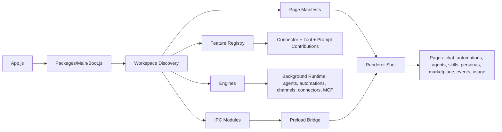

# Joanium

Joanium is a local-first Electron desktop app for people who want an AI assistant that can actually work with projects, files, tools, schedules, personal context, and real integrations instead of acting like a thin chat wrapper.

It combines multi-provider chat, workspace-aware assistance, scheduled automations, autonomous agents, MCP, browser tooling, markdown-based skills and personas, and a discovery-driven extension system in one desktop product.

## Why Joanium

- Local-first state: chats, projects, skills, personas, memories, usage data, and feature state are stored on the machine instead of being hidden behind a remote app backend.
- Multi-provider by design: Anthropic, OpenAI, Google, OpenRouter, Mistral, NVIDIA, DeepSeek, MiniMax, Ollama, and LM Studio are already wired into setup and runtime model selection.
- Project-aware chat: the main chat experience can reason over an active workspace, inspect local files, run commands, manage attachments, and keep project-scoped chat history.
- More than chat: Joanium ships pages and engines for automations, agents, skills, personas, marketplace installs, events, and usage analytics.
- Real tool surface: the assistant can use local workspace tools, document extraction, browser preview, MCP servers, connector-backed integrations, and feature-defined chat tools.
- Extensible architecture: features, engines, IPC modules, services, and renderer pages are discovered from npm workspace packages instead of being manually hard-coded into one central file.

## What Ships Today

| Area        | What it does                                                                                                                            |
| ----------- | --------------------------------------------------------------------------------------------------------------------------------------- |
| Setup       | First-run onboarding for user profile and AI provider configuration.                                                                    |
| Chat        | The main AI workspace with attachments, model selection, project context, tool use, MCP, browser preview, and chat persistence.         |
| Automations | Scheduled jobs that gather data, call AI, and trigger outputs such as notifications, files, webhooks, and integration-specific actions. |
| Agents      | Reusable scheduled prompts that run against a chosen model and optional project/workspace context.                                      |
| Skills      | Markdown-defined skill library with enable/disable controls and first-run seeding.                                                      |
| Personas    | Markdown-defined personas that influence the system prompt and user-facing behavior.                                                    |
| Marketplace | Remote skill/persona discovery and installation from the Joanium marketplace.                                                           |
| Events      | Execution history across background runs, including failures and recent activity.                                                       |
| Usage       | Local token and model usage analytics.                                                                                                  |

## Current Capability Surface

Joanium already includes:

- Provider support for Anthropic, OpenAI, Google, OpenRouter, Mistral, NVIDIA, DeepSeek, MiniMax, Ollama, and LM Studio.
- Capability packages for GitHub, GitLab, Google Workspace, and a collection of free connectors.
- Google sub-capabilities for Calendar, Contacts, Docs, Drive, Forms, Gmail, Photos, Sheets, Slides, Tasks, and YouTube.
- MCP support for builtin, stdio, and HTTP servers, including a builtin browser MCP server.
- Channel engine support for Telegram, WhatsApp, Discord, and Slack.
- Document extraction for text/code files, PDF, DOCX, XLSX/XLSM, and PPTX attachments.

## Architecture Snapshot



The key architectural idea is that Joanium is assembled from discovery roots declared in workspace `package.json` files. Feature packages contribute connectors, chat tools, automation data sources, output handlers, prompt context, and even additional pages. Engine packages contribute long-lived runtime behavior. IPC and page registration are also discovered instead of being manually wired one by one.

## Repository Layout

```text
App.js                          Electron entrypoint
Core/Electron/Bridge/           Preload bridge exposed to the renderer
Packages/Main/                  Boot, discovery, paths, services, IPC registration
Packages/Features/              Engines and platform features
Packages/Capabilities/          Integration and capability feature packages
Packages/Pages/                 User-facing pages and page manifests
Packages/Renderer/              SPA shell, page loading, sidebar wiring
Packages/System/                Shared contracts, state, prompt helpers, utilities
Config/                         Model catalogs and bundled configuration
Data/                           Runtime state in development mode
Instructions/                   User custom instructions
Memories/                       Personal memory markdown files
Skills/                         Seed skill library
Personas/                       Seed persona library
SystemInstructions/             Base system prompt instructions
Docs/                           Project documentation
```

Important note: in development mode, Joanium stores runtime state inside the repo root. In packaged builds, that state moves to Electron `userData`. That makes local development simple, but it also means contributors should avoid accidentally committing local runtime data.

## Quick Start

### Prerequisites

- Node.js and npm
- A supported AI provider key, or a local model server such as Ollama or LM Studio

### Run locally

```bash
npm install
npm start
```

For development mode:

```bash
npm run dev
```

Useful commands:

```bash
npm run lint
npm run build
npm run packages:audit
```

On Windows PowerShell, if `npm` script execution is blocked by policy, run:

```powershell
cmd /c npm run packages:audit
```

## Development Notes

- `App.js` creates required runtime directories, seeds skills/personas and personal memory files, boots the feature system, starts engines, creates the main window, and auto-connects MCP servers.
- `Packages/Main/Boot.js` is the central assembly point for feature discovery, engine discovery, storage creation, lifecycle hooks, and IPC registration.
- `Packages/Renderer/Application/Main.js` is the renderer shell that discovers pages, builds the sidebar, mounts/unmounts pages, and initializes renderer gateways.
- `Packages/Capabilities/Core/FeatureRegistry.js` is the main composition layer for connector definitions, prompt sections, chat tools, automation hooks, and feature pages.

## Documentation

Start here if you want the full repo map:

- [Docs/README.md](Docs/README.md)
- [Docs/Architecture.md](Docs/Architecture.md)
- [Docs/Features.md](Docs/Features.md)
- [Docs/Data-And-Persistence.md](Docs/Data-And-Persistence.md)
- [Docs/Extension-Guide.md](Docs/Extension-Guide.md)
- [Docs/Where-To-Change-What.md](Docs/Where-To-Change-What.md)
- [Docs/Development-Workflow.md](Docs/Development-Workflow.md)

## Extending Joanium

At a high level:

1. Add or update a workspace package.
2. Declare discovery roots through `joanium.discovery` in that package's `package.json`.
3. Export a `Feature.js`, `*Engine.js`, `*IPC.js`, `Page.js`, or `*Service.js` from the matching discovery root.
4. Let boot-time discovery register the new capability automatically.

The detailed guide is here:

- [Docs/Extension-Guide.md](Docs/Extension-Guide.md)

## Contributing

Joanium already includes contribution, security, and conduct docs:

- [CONTRIBUTING.md](CONTRIBUTING.md)
- [SECURITY.md](SECURITY.md)
- [CODE_OF_CONDUCT.md](CODE_OF_CONDUCT.md)

## License

MIT. See [LICENSE](LICENSE).
